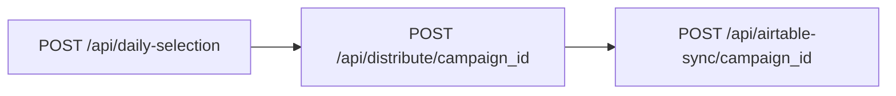

## Endpoint

```
POST /api/daily-selection
```

Creates a new campaign and selects 14,400 unused profiles from the `global_usernames` table. This is the first step in the VA assignment workflow.

## Request Body

This endpoint does not require a request body.

## Response Fields

<ResponseField name="success" type="boolean" required>
  Indicates whether the campaign was created successfully.
</ResponseField>

<ResponseField name="campaign_id" type="string" required>
  UUID of the newly created campaign. Use this ID for subsequent distribute and sync operations.
</ResponseField>

<ResponseField name="total_selected" type="number" required>
  Number of profiles selected for this campaign (should always be 14,400 if successful).
</ResponseField>

<ResponseField name="campaign_date" type="string" required>
  Date of the campaign in YYYY-MM-DD format.
</ResponseField>

## Example Request

<CodeGroup>
```bash cURL
curl -X POST http://localhost:5001/api/daily-selection
```

```typescript TypeScript
const response = await fetch(`${process.env.NEXT_PUBLIC_API_URL}/api/daily-selection`, {
  method: 'POST',
  headers: {
    'Content-Type': 'application/json',
  }
});

const data = await response.json();
```

```python Python
import requests

url = 'http://localhost:5001/api/daily-selection'
response = requests.post(url)
data = response.json()
```
</CodeGroup>

## Example Response

```json
{
  "success": true,
  "campaign_id": "550e8400-e29b-41d4-a716-446655440000",
  "total_selected": 14400,
  "campaign_date": "2025-10-06"
}
```

## Database Operations

This endpoint performs the following database operations:

### 1. Create Campaign Record

Inserts a new record into the `campaigns` table:

```sql
INSERT INTO campaigns (campaign_id, campaign_date, total_assigned, status)
VALUES (uuid_generate_v4(), CURRENT_DATE, 14400, 'pending');
```

### 2. Select Unused Profiles

Queries the `global_usernames` table for unused profiles:

```sql
SELECT username FROM global_usernames
WHERE used = false
ORDER BY created_at ASC
LIMIT 14400;
```

### 3. Mark Profiles as Used

Updates selected profiles to prevent reuse:

```sql
UPDATE global_usernames
SET used = true
WHERE username IN (selected_usernames);
```

### 4. Create Assignments

Inserts assignment records into `daily_assignments` table:

```sql
INSERT INTO daily_assignments (campaign_id, username, va_table_number)
VALUES (campaign_id, username, table_number);
```

## Campaign Configuration

The daily selection target is configurable via environment variables:

```bash .env.local
NEXT_PUBLIC_DAILY_SELECTION_TARGET=14400
```

**Default Configuration:**
- **Total Profiles:** 14,400
- **VA Tables:** 80
- **Profiles per VA:** 180

<Note>
  The system automatically distributes the 14,400 profiles evenly across 80 VA tables, resulting in 180 profiles per VA.
</Note>

## Campaign Workflow

The daily selection is part of a three-step workflow:



1. **Daily Selection (0-33%):** Creates campaign, selects profiles
2. **Distribution (33-66%):** Assigns profiles to VA tables
3. **Airtable Sync (66-100%):** Syncs to Airtable for VA access

## Error Responses

### Insufficient Profiles

```json
{
  "success": false,
  "error": "Insufficient unused profiles",
  "details": {
    "required": 14400,
    "available": 8500
  }
}
```

<Warning>
  If you receive this error, you need to run the scraping workflow to add more profiles to the database.
</Warning>

**Solution:**
```bash
# Check available unused profiles
curl http://localhost:5001/api/username-count

# If count < 14400, run scraping
curl -X POST http://localhost:5001/api/scrape-followers \
  -H "Content-Type: application/json" \
  -d '{"accounts": ["account1", "account2"], "targetGender": "male"}'
```

### Database Error

```json
{
  "success": false,
  "error": "Database error: Failed to create campaign"
}
```

### Campaign Already Exists

```json
{
  "success": false,
  "error": "Campaign already exists for today",
  "details": {
    "existing_campaign_id": "550e8400-e29b-41d4-a716-446655440000",
    "campaign_date": "2025-10-06"
  }
}
```

## Username Pool Status

Before creating a campaign, check the username pool status:

```sql
-- Check available unused profiles
SELECT COUNT(*) FROM global_usernames WHERE used = false;

-- Check total profiles
SELECT COUNT(*) FROM global_usernames;

-- Check usage percentage
SELECT 
  COUNT(*) FILTER (WHERE used = true) as used_count,
  COUNT(*) FILTER (WHERE used = false) as available_count,
  ROUND(100.0 * COUNT(*) FILTER (WHERE used = true) / COUNT(*), 2) as usage_percent
FROM global_usernames;
```

<Tip>
  Monitor your username pool regularly. If available profiles drop below 28,800 (2 days worth), run the scraping workflow to replenish.
</Tip>

## Campaign Lifecycle

Campaigns have a 7-day lifecycle:

1. **Day 0:** Campaign created (`status='pending'`)
2. **Day 0-6:** VAs work on assigned profiles
3. **Day 7:** Campaign auto-cleaned (profiles marked `used=false` again)

The cleanup happens via the `/api/cleanup` cron job:

```bash
# Run daily at 2 AM
0 2 * * * curl -X POST http://localhost:5001/api/cleanup
```

## Next Steps

<CardGroup cols={2}>
  <Card title="Distribute Profiles" icon="arrow-right" href="/api/distribute">
    Learn how to distribute profiles to VA tables
  </Card>
  <Card title="Ingest Profiles" icon="arrow-left" href="/api/ingest">
    Go back to learn about profile ingestion
  </Card>
</CardGroup>