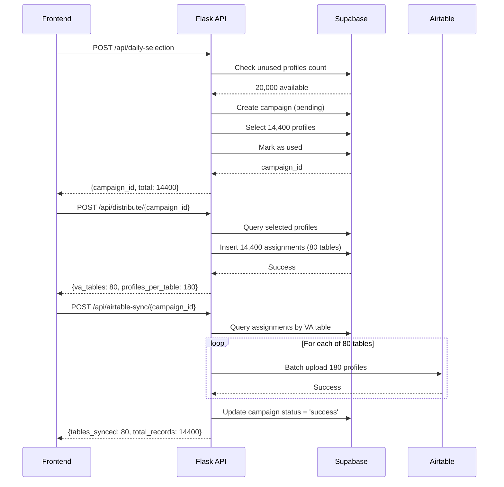

## Overview

The Click Creators Scraper backend is a **Flask-based REST API** that orchestrates Instagram scraping, database ingestion, campaign creation, VA distribution, and Airtable synchronization.

## Base Configuration

### Environment Variables

```bash
# Frontend (.env.local)
NEXT_PUBLIC_API_URL=http://localhost:5001

# Backend (.env)
SUPABASE_URL=https://your-project.supabase.co
SUPABASE_KEY=your-service-role-key
APIFY_API_KEY=your-apify-key
APIFY_ACTOR_ID=your-actor-id
AIRTABLE_API_KEY=your-airtable-key
AIRTABLE_BASE_ID=your-base-id
GENDER_API_KEY=your-gender-api-key
```

### Base URL

**Development:** `http://localhost:5001`  
**Production:** Configure via `NEXT_PUBLIC_API_URL`

---

## API Endpoints

### 1. Scrape Followers

Scrapes Instagram followers from source accounts with gender filtering.

```http
POST /api/scrape-followers
```

#### Request Body

```json
{
  "accounts": ["username1", "username2"],
  "targetGender": "male"
}
```

<ParamField body="accounts" type="string[]" required>
  Array of Instagram usernames to scrape followers from
</ParamField>

<ParamField body="targetGender" type="string" default="male">
  Gender filter: `male`, `female`, or `all`
</ParamField>

#### Response

<Tabs>
  <Tab title="Success (200)">
    ```json
    {
      "success": true,
      "data": {
        "accounts": [
          {
            "username": "username1",
            "full_name": "John Doe",
            "follower_count": 15000,
            "following_count": 500,
            "post_count": 120,
            "is_verified": false,
            "is_private": false,
            "biography": "Photographer and traveler",
            "url": "https://instagram.com/username1",
            "detected_gender": "male"
          }
        ],
        "totalScraped": 1000,
        "totalFiltered": 450,
        "genderDistribution": {
          "male": 450,
          "female": 400,
          "unknown": 150
        }
      }
    }
    ```
  </Tab>
  <Tab title="Error (400/500)">
    ```json
    {
      "success": false,
      "error": "Error message here"
    }
    ```
  </Tab>
</Tabs>

#### Process Flow

1. **Apify Scraper:** Calls Apify Instagram Follower Scraper actor
2. **Data Extraction:** Retrieves follower profiles with metadata
3. **Gender Detection:** Applies name-based gender detection API
4. **Filtering:** Returns only profiles matching `targetGender`

#### Usage Example

```typescript
// Frontend: dependencies-card.tsx
const response = await fetch(`${process.env.NEXT_PUBLIC_API_URL}/api/scrape-followers`, {
  method: 'POST',
  headers: { 'Content-Type': 'application/json' },
  body: JSON.stringify({
    accounts: sourceProfiles.map(p => p.username),
    targetGender: 'male'
  })
});

const result = await response.json();
console.log(`Scraped ${result.data.totalFiltered} male profiles`);
```

<Note>
  Scraping duration varies based on source account size. Expect 10-50% progress for large accounts (100k+ followers).
</Note>

---

### 2. Ingest Profiles

Ingests scraped profiles into the database with deduplication.

```http
POST /api/ingest
```

#### Request Body

```json
{
  "profiles": [
    {
      "id": "instagram-id-1",
      "username": "username1",
      "full_name": "John Doe",
      "follower_count": 15000,
      "following_count": 500,
      "post_count": 120,
      "is_verified": false,
      "is_private": false,
      "biography": "Photographer",
      "url": "https://instagram.com/username1",
      "detected_gender": "male"
    }
  ]
}
```

<ParamField body="profiles" type="object[]" required>
  Array of profile objects from scraping results
</ParamField>

#### Response

<Tabs>
  <Tab title="Success (200)">
    ```json
    {
      "success": true,
      "message": "Profiles ingested successfully",
      "stats": {
        "total_processed": 450,
        "new_profiles": 380,
        "duplicates": 70
      }
    }
    ```
  </Tab>
  <Tab title="Error (400/500)">
    ```json
    {
      "success": false,
      "error": "Database error message"
    }
    ```
  </Tab>
</Tabs>

#### Database Operations

1. **Insert into `raw_scraped_profiles`:** Stores all profile data
2. **Insert into `global_usernames`:** Adds unique usernames only (ON CONFLICT DO NOTHING)
3. **Deduplication:** Automatically handled by `global_usernames` primary key

#### Usage Example

```typescript
// Auto-triggered after scraping completes
const ingestResponse = await fetch(`${process.env.NEXT_PUBLIC_API_URL}/api/ingest`, {
  method: 'POST',
  headers: { 'Content-Type': 'application/json' },
  body: JSON.stringify({ profiles: scrapeResult.data.accounts })
});

const ingestResult = await ingestResponse.json();
console.log(`${ingestResult.stats.new_profiles} new profiles added`);
```

---

### 3. Daily Selection (Campaign Creation)

Creates a campaign and selects 14,400 unused profiles.

```http
POST /api/daily-selection
```

#### Request Body

No body required.

#### Response

<Tabs>
  <Tab title="Success (200)">
    ```json
    {
      "success": true,
      "campaign_id": "550e8400-e29b-41d4-a716-446655440000",
      "total_selected": 14400,
      "campaign_date": "2025-10-06"
    }
    ```
  </Tab>
  <Tab title="Insufficient Profiles (400)">
    ```json
    {
      "success": false,
      "error": "Insufficient unused profiles. Available: 10000, Required: 14400"
    }
    ```
  </Tab>
</Tabs>

<ResponseField name="campaign_id" type="UUID">
  Unique campaign identifier
</ResponseField>

<ResponseField name="total_selected" type="number">
  Number of profiles selected (should be 14,400)
</ResponseField>

<ResponseField name="campaign_date" type="date">
  Campaign creation date (YYYY-MM-DD)
</ResponseField>

#### Process Flow

1. **Check Availability:** Verify ≥14,400 unused usernames exist
2. **Create Campaign:** Insert into `campaigns` table with status `pending`
3. **Select Profiles:** Query `global_usernames WHERE used = false LIMIT 14400`
4. **Mark as Used:** Update `global_usernames SET used = true`
5. **Return Campaign ID:** For use in distribution and sync endpoints

#### SQL Operations

```sql
-- Check available profiles
SELECT COUNT(*) FROM global_usernames WHERE used = false;

-- Create campaign
INSERT INTO campaigns (campaign_date, total_assigned, status)
VALUES (CURRENT_DATE, 14400, 'pending')
RETURNING campaign_id;

-- Mark profiles as used
UPDATE global_usernames SET used = true
WHERE username IN (
  SELECT username FROM global_usernames
  WHERE used = false
  ORDER BY created_at
  LIMIT 14400
);
```

#### Usage Example

```typescript
// Frontend: payments-table.tsx
const response = await fetch(`${process.env.NEXT_PUBLIC_API_URL}/api/daily-selection`, {
  method: 'POST'
});

const result = await response.json();
setCampaignId(result.campaign_id);
```

---

### 4. Distribute to VAs

Distributes campaign profiles across 80 VA tables.

```http
POST /api/distribute/{campaign_id}
```

<ParamField path="campaign_id" type="UUID" required>
  Campaign ID from daily selection
</ParamField>

#### Response

<Tabs>
  <Tab title="Success (200)">
    ```json
    {
      "success": true,
      "campaign_id": "550e8400-e29b-41d4-a716-446655440000",
      "va_tables": 80,
      "profiles_per_table": 180
    }
    ```
  </Tab>
  <Tab title="Error (404/500)">
    ```json
    {
      "success": false,
      "error": "Campaign not found"
    }
    ```
  </Tab>
</Tabs>

#### Distribution Algorithm

**Formula:** 14,400 profiles ÷ 80 VAs = 180 profiles per VA

**Implementation:**
```python
va_table_number = 1
for username in selected_usernames:
    # Insert into daily_assignments
    insert_assignment(campaign_id, username, va_table_number)
    
    # Rotate to next VA table
    va_table_number = (va_table_number % 80) + 1
```

#### Database Operations

```sql
-- Insert assignments (pseudocode)
INSERT INTO daily_assignments (campaign_id, username, va_table_number)
VALUES 
  ('campaign-id', 'username1', 1),
  ('campaign-id', 'username2', 2),
  ...
  ('campaign-id', 'username14400', 80);
```

#### Usage Example

```typescript
// Sequential after daily-selection
const distributeResponse = await fetch(
  `${process.env.NEXT_PUBLIC_API_URL}/api/distribute/${campaignId}`,
  { method: 'POST' }
);

const distributeResult = await distributeResponse.json();
console.log(`Distributed to ${distributeResult.va_tables} tables`);
```

---

### 5. Airtable Sync

Syncs campaign profiles to 80 Airtable tables.

```http
POST /api/airtable-sync/{campaign_id}
```

<ParamField path="campaign_id" type="UUID" required>
  Campaign ID from daily selection
</ParamField>

#### Response

<Tabs>
  <Tab title="Success (200)">
    ```json
    {
      "success": true,
      "campaign_id": "550e8400-e29b-41d4-a716-446655440000",
      "tables_synced": 80,
      "total_records": 14400
    }
    ```
  </Tab>
  <Tab title="Error (404/500)">
    ```json
    {
      "success": false,
      "error": "Airtable API error: Rate limit exceeded"
    }
    ```
  </Tab>
</Tabs>

#### Process Flow

1. **Query Assignments:** Get profiles grouped by `va_table_number`
2. **Format Records:** Convert to Airtable record format
3. **Batch Upload:** Upload to each table (Table 1 - Table 80)
4. **Rate Limiting:** Add delays between batches to respect Airtable limits
5. **Update Campaign Status:** Set `status = 'success'` on completion

#### Airtable Table Structure

Each of the 80 tables has:

| Field Name | Type | Description |
|------------|------|-------------|
| Username | Text | Instagram username |
| Full Name | Text | Display name |
| Follower Count | Number | Follower count |
| URL | URL | Instagram profile link |
| Campaign Date | Date | Assignment date |

#### Usage Example

```typescript
// Sequential after distribute
const syncResponse = await fetch(
  `${process.env.NEXT_PUBLIC_API_URL}/api/airtable-sync/${campaignId}`,
  { method: 'POST' }
);

const syncResult = await syncResponse.json();
console.log(`Synced ${syncResult.total_records} records to Airtable`);
```

<Warning>
  Airtable has rate limits (5 requests/second). The API includes automatic delays to prevent throttling.
</Warning>

---

### 6. Cleanup Old Campaigns

Deletes campaigns older than 7 days and frees up usernames.

```http
POST /api/cleanup
```

#### Request Body

No body required.

#### Response

```json
{
  "success": true,
  "campaigns_cleaned": 5,
  "profiles_freed": 72000
}
```

<ResponseField name="campaigns_cleaned" type="number">
  Number of campaigns deleted
</ResponseField>

<ResponseField name="profiles_freed" type="number">
  Number of usernames marked as `used = false`
</ResponseField>

#### Process Flow

1. **Find Old Campaigns:** `WHERE created_at < NOW() - INTERVAL '7 days'`
2. **Get Usernames:** Query `daily_assignments` for affected usernames
3. **Free Usernames:** Update `global_usernames SET used = false`
4. **Delete Assignments:** Remove records from `daily_assignments`
5. **Delete Campaigns:** Remove records from `campaigns`

#### Cron Job Setup

**Schedule:** Daily at 2 AM

```bash
# Add to crontab
0 2 * * * curl -X POST http://localhost:5001/api/cleanup
```

**Docker/Kubernetes:**
```yaml
apiVersion: batch/v1
kind: CronJob
metadata:
  name: campaign-cleanup
spec:
  schedule: "0 2 * * *"
  jobTemplate:
    spec:
      template:
        spec:
          containers:
          - name: cleanup
            image: curlimages/curl:latest
            args:
            - "/bin/sh"
            - "-c"
            - "curl -X POST http://api:5001/api/cleanup"
```

---

## Complete Workflow

### Campaign Creation Flow

This is the complete sequence executed when clicking "Assign to VAs":



### Progress Tracking

```typescript
// Frontend progress calculation
const trackProgress = async () => {
  setProgress(0); // Creating campaign (0%)
  
  const selectionResult = await createCampaign();
  setProgress(33); // Campaign created (33%)
  
  const distributeResult = await distributeToVAs(selectionResult.campaign_id);
  setProgress(66); // Distribution complete (66%)
  
  const syncResult = await syncToAirtable(selectionResult.campaign_id);
  setProgress(100); // Sync complete (100%)
};
```

---

## Error Handling

### Common Errors

<AccordionGroup>
  <Accordion title="Insufficient Profiles (400)">
    **Cause:** Less than 14,400 unused usernames available
    
    **Solution:**
    1. Run scraping workflow to add more profiles
    2. Check `global_usernames` table: `SELECT COUNT(*) FROM global_usernames WHERE used = false`
    3. Verify ingestion completed successfully
    
    ```json
    {
      "success": false,
      "error": "Insufficient unused profiles. Available: 10000, Required: 14400"
    }
    ```
  </Accordion>

  <Accordion title="Campaign Not Found (404)">
    **Cause:** Invalid `campaign_id` in distribute or sync request
    
    **Solution:**
    1. Verify campaign was created successfully
    2. Check `campaign_id` matches response from `/api/daily-selection`
    3. Query database: `SELECT * FROM campaigns WHERE campaign_id = 'uuid'`
    
    ```json
    {
      "success": false,
      "error": "Campaign not found"
    }
    ```
  </Accordion>

  <Accordion title="Airtable Rate Limit (429)">
    **Cause:** Exceeded Airtable API rate limits (5 req/sec)
    
    **Solution:**
    - API automatically retries with exponential backoff
    - If persistent, increase delay between batches in backend code
    
    ```json
    {
      "success": false,
      "error": "Airtable API error: Rate limit exceeded"
    }
    ```
  </Accordion>

  <Accordion title="Apify Scraper Failed (500)">
    **Cause:** Instagram scraping failed (account private, rate limited, etc.)
    
    **Solution:**
    1. Verify source accounts are public
    2. Check Apify actor run logs in Apify dashboard
    3. Verify `APIFY_API_KEY` and `APIFY_ACTOR_ID` are correct
    4. Ensure Apify account has sufficient run quota
    
    ```json
    {
      "success": false,
      "error": "Apify scraper error: Account is private"
    }
    ```
  </Accordion>
</AccordionGroup>

---

## Testing

### Manual Testing with cURL

```bash
# 1. Test scraping
curl -X POST http://localhost:5001/api/scrape-followers \
  -H "Content-Type: application/json" \
  -d '{"accounts": ["username1"], "targetGender": "male"}'

# 2. Test ingestion
curl -X POST http://localhost:5001/api/ingest \
  -H "Content-Type: application/json" \
  -d '{"profiles": [{...}]}'

# 3. Create campaign
curl -X POST http://localhost:5001/api/daily-selection

# 4. Distribute (replace {campaign_id})
curl -X POST http://localhost:5001/api/distribute/{campaign_id}

# 5. Sync to Airtable (replace {campaign_id})
curl -X POST http://localhost:5001/api/airtable-sync/{campaign_id}

# 6. Run cleanup
curl -X POST http://localhost:5001/api/cleanup
```

### Postman Collection

Import this collection for easy testing:

```json
{
  "info": {
    "name": "Click Creators Scraper API",
    "schema": "https://schema.getpostman.com/json/collection/v2.1.0/collection.json"
  },
  "item": [
    {
      "name": "Scrape Followers",
      "request": {
        "method": "POST",
        "url": "{{base_url}}/api/scrape-followers",
        "body": {
          "mode": "raw",
          "raw": "{\"accounts\": [\"username1\"], \"targetGender\": \"male\"}"
        }
      }
    }
  ],
  "variable": [
    {
      "key": "base_url",
      "value": "http://localhost:5001"
    }
  ]
}
```

---

## Rate Limits

### External API Limits

<CardGroup cols={2}>
  <Card title="Apify" icon="spider">
    - **Requests:** Based on account tier
    - **Runs:** Limited by monthly quota
    - **Solution:** Monitor usage in Apify dashboard
  </Card>
  <Card title="Airtable" icon="table">
    - **Rate:** 5 requests/second
    - **Records:** 10 per request (batch)
    - **Solution:** Backend implements automatic delays
  </Card>
  <Card title="Gender API" icon="user">
    - **Requests:** Varies by provider
    - **Solution:** Cache results, batch requests
  </Card>
  <Card title="Instagram" icon="instagram">
    - **Scraping:** Apify handles rate limiting
    - **Solution:** Trust Apify's built-in throttling
  </Card>
</CardGroup>

---

## Next Steps

<CardGroup cols={2}>
  <Card title="Database Schema" icon="database" href="/architecture/database-schema">
    Understand database tables and relationships
  </Card>
  <Card title="System Architecture" icon="sitemap" href="/architecture/overview">
    View overall system architecture
  </Card>
</CardGroup>