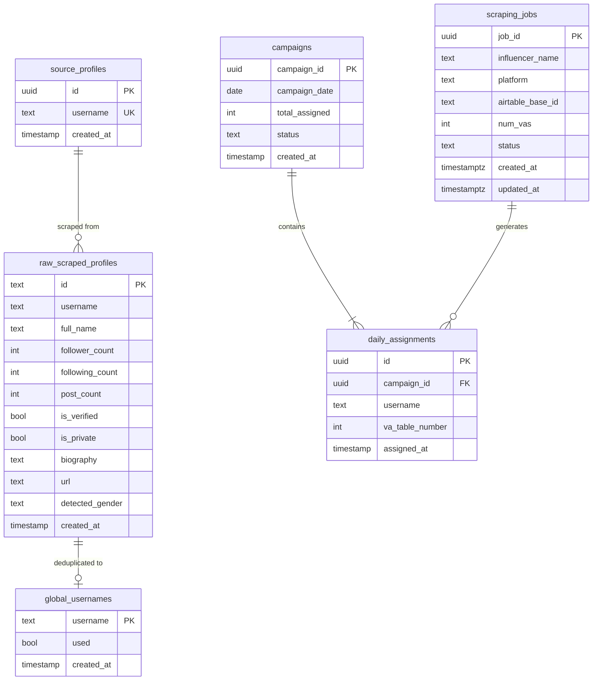

## Overview

Click Creators Scraper uses **Supabase PostgreSQL** with a six-table architecture designed for deduplication, campaign tracking, and multi-tenant job management.

## Database Tables

### Table Relationships



## Table Definitions

### 1. source_profiles

Stores Instagram accounts to scrape followers from.

```sql
CREATE TABLE source_profiles (
  id UUID PRIMARY KEY DEFAULT uuid_generate_v4(),
  username TEXT NOT NULL UNIQUE,
  created_at TIMESTAMP DEFAULT NOW()
);
```

#### Fields

<ResponseField name="id" type="UUID" required>
  Primary key, auto-generated
</ResponseField>

<ResponseField name="username" type="TEXT" required>
  Instagram username (unique constraint)
</ResponseField>

<ResponseField name="created_at" type="TIMESTAMP" default="NOW()">
  Record creation timestamp
</ResponseField>

#### Usage

- **Component:** `dependencies-card.tsx`
- **Action:** Admin adds source accounts via "Edit Source Profiles" dialog
- **Query Example:**

```sql
-- Get all source profiles
SELECT * FROM source_profiles ORDER BY created_at DESC;

-- Add new source profile
INSERT INTO source_profiles (username) VALUES ('username')
ON CONFLICT (username) DO NOTHING;
```

---

### 2. raw_scraped_profiles

Stores all scraped Instagram profiles with complete metadata.

```sql
CREATE TABLE raw_scraped_profiles (
  id TEXT PRIMARY KEY,
  username TEXT,
  full_name TEXT,
  follower_count INTEGER,
  following_count INTEGER,
  post_count INTEGER,
  is_verified BOOLEAN,
  is_private BOOLEAN,
  biography TEXT,
  url TEXT,
  detected_gender TEXT,
  created_at TIMESTAMP DEFAULT NOW()
);
```

#### Fields

<ResponseField name="id" type="TEXT" required>
  Instagram profile ID (from Apify scraper)
</ResponseField>

<ResponseField name="username" type="TEXT">
  Instagram username
</ResponseField>

<ResponseField name="full_name" type="TEXT">
  Display name on Instagram profile
</ResponseField>

<ResponseField name="follower_count" type="INTEGER">
  Number of followers
</ResponseField>

<ResponseField name="following_count" type="INTEGER">
  Number of accounts following
</ResponseField>

<ResponseField name="post_count" type="INTEGER">
  Number of posts on profile
</ResponseField>

<ResponseField name="is_verified" type="BOOLEAN">
  Instagram verification status
</ResponseField>

<ResponseField name="is_private" type="BOOLEAN">
  Account privacy setting
</ResponseField>

<ResponseField name="biography" type="TEXT">
  Profile bio text
</ResponseField>

<ResponseField name="url" type="TEXT">
  Instagram profile URL
</ResponseField>

<ResponseField name="detected_gender" type="TEXT">
  Gender detection result ("male", "female", "unknown")
</ResponseField>

<ResponseField name="created_at" type="TIMESTAMP" default="NOW()">
  Record creation timestamp
</ResponseField>

#### Usage

- **API Endpoint:** `POST /api/ingest`
- **Component:** `payments-table.tsx` (displays scraped profiles)
- **Purpose:** Retain all scraped data for analysis and auditing

#### Query Examples

```sql
-- Get recent scraped profiles
SELECT * FROM raw_scraped_profiles 
ORDER BY created_at DESC 
LIMIT 100;

-- Get gender distribution
SELECT detected_gender, COUNT(*) as count
FROM raw_scraped_profiles
GROUP BY detected_gender;

-- Get verified male profiles
SELECT username, full_name, follower_count
FROM raw_scraped_profiles
WHERE is_verified = true AND detected_gender = 'male'
ORDER BY follower_count DESC;
```

---

### 3. global_usernames

Deduplicated username pool for campaign assignment.

```sql
CREATE TABLE global_usernames (
  username TEXT PRIMARY KEY,
  used BOOLEAN DEFAULT FALSE,
  created_at TIMESTAMP DEFAULT NOW()
);
```

#### Fields

<ResponseField name="username" type="TEXT" required>
  Unique Instagram username (primary key)
</ResponseField>

<ResponseField name="used" type="BOOLEAN" default="false">
  Whether username has been assigned to a campaign
</ResponseField>

<ResponseField name="created_at" type="TIMESTAMP" default="NOW()">
  Record creation timestamp
</ResponseField>

#### Purpose

**Deduplication Strategy:**
- Prevents duplicate assignments across campaigns
- `used = false` indicates available for next campaign
- `used = true` indicates already assigned

#### Usage

- **API Endpoint:** `POST /api/daily-selection`
- **Component:** `username-status-card.tsx` (shows unused count)
- **Daily Target:** 14,400 unused usernames required

#### Query Examples

```sql
-- Check unused username count
SELECT COUNT(*) as unused_count 
FROM global_usernames 
WHERE used = false;

-- Select profiles for campaign (14,400)
SELECT username FROM global_usernames
WHERE used = false
ORDER BY created_at
LIMIT 14400;

-- Mark usernames as used
UPDATE global_usernames
SET used = true
WHERE username IN (SELECT username FROM daily_assignments WHERE campaign_id = ?);

-- Reset usernames after campaign cleanup (7 days)
UPDATE global_usernames
SET used = false
WHERE username IN (
  SELECT username FROM daily_assignments da
  JOIN campaigns c ON da.campaign_id = c.campaign_id
  WHERE c.created_at < NOW() - INTERVAL '7 days'
);
```

---

### 4. campaigns

Campaign tracking and status management.

```sql
CREATE TABLE campaigns (
  campaign_id UUID PRIMARY KEY DEFAULT uuid_generate_v4(),
  campaign_date DATE NOT NULL,
  total_assigned INTEGER NOT NULL,
  status TEXT CHECK (status IN ('pending', 'success', 'failed')),
  created_at TIMESTAMP DEFAULT NOW()
);
```

#### Fields

<ResponseField name="campaign_id" type="UUID" required>
  Primary key, auto-generated
</ResponseField>

<ResponseField name="campaign_date" type="DATE" required>
  Date of campaign creation
</ResponseField>

<ResponseField name="total_assigned" type="INTEGER" required>
  Total profiles assigned (should be 14,400)
</ResponseField>

<ResponseField name="status" type="TEXT" required>
  Campaign status: `pending`, `success`, or `failed`
</ResponseField>

<ResponseField name="created_at" type="TIMESTAMP" default="NOW()">
  Record creation timestamp
</ResponseField>

#### Status Values

<Tabs>
  <Tab title="pending">
    Campaign is in progress (creating, distributing, or syncing)
  </Tab>
  <Tab title="success">
    Campaign completed successfully - all profiles synced to Airtable
  </Tab>
  <Tab title="failed">
    Campaign failed during creation, distribution, or sync
  </Tab>
</Tabs>

#### Usage

- **API Endpoint:** `POST /api/daily-selection`
- **Component:** `campaigns-table.tsx` (displays campaign history)
- **Lifecycle:** 7 days before cleanup via `POST /api/cleanup`

#### Query Examples

```sql
-- Get recent campaigns
SELECT * FROM campaigns 
ORDER BY created_at DESC 
LIMIT 10;

-- Get campaign success rate
SELECT status, COUNT(*) as count
FROM campaigns
GROUP BY status;

-- Find campaigns older than 7 days for cleanup
SELECT * FROM campaigns
WHERE created_at < NOW() - INTERVAL '7 days';

-- Get today's campaign
SELECT * FROM campaigns
WHERE campaign_date = CURRENT_DATE;
```

---

### 5. daily_assignments

Profile-to-campaign assignments with VA table mapping.

```sql
CREATE TABLE daily_assignments (
  id UUID PRIMARY KEY DEFAULT uuid_generate_v4(),
  campaign_id UUID REFERENCES campaigns(campaign_id),
  username TEXT,
  va_table_number INTEGER,
  assigned_at TIMESTAMP DEFAULT NOW()
);
```

#### Fields

<ResponseField name="id" type="UUID" required>
  Primary key, auto-generated
</ResponseField>

<ResponseField name="campaign_id" type="UUID" required>
  Foreign key to `campaigns` table
</ResponseField>

<ResponseField name="username" type="TEXT">
  Instagram username assigned
</ResponseField>

<ResponseField name="va_table_number" type="INTEGER">
  VA table number (1-80)
</ResponseField>

<ResponseField name="assigned_at" type="TIMESTAMP" default="NOW()">
  Assignment timestamp
</ResponseField>

#### Distribution Logic

**Algorithm:**
- 14,400 profiles ÷ 80 VAs = 180 profiles per VA
- `va_table_number` ranges from 1 to 80
- Round-robin distribution

#### Usage

- **API Endpoint:** `POST /api/distribute/{campaign_id}`
- **Sync Target:** Airtable tables (Table 1 - Table 80)

#### Query Examples

```sql
-- Get assignments for a campaign
SELECT * FROM daily_assignments
WHERE campaign_id = 'uuid-here'
ORDER BY va_table_number, assigned_at;

-- Get profiles for specific VA table
SELECT username FROM daily_assignments
WHERE campaign_id = 'uuid-here' AND va_table_number = 5;

-- Count profiles per VA table
SELECT va_table_number, COUNT(*) as profile_count
FROM daily_assignments
WHERE campaign_id = 'uuid-here'
GROUP BY va_table_number
ORDER BY va_table_number;

-- Verify equal distribution (should all be 180)
SELECT va_table_number, COUNT(*) as count
FROM daily_assignments
WHERE campaign_id = 'uuid-here'
GROUP BY va_table_number
HAVING COUNT(*) != 180;
```

---

### 6. scraping_jobs

Multi-tenant scraping job management for multiple platforms.

```sql
CREATE TABLE scraping_jobs (
  job_id UUID PRIMARY KEY DEFAULT uuid_generate_v4(),
  influencer_name TEXT NOT NULL,
  platform TEXT NOT NULL,
  airtable_base_id TEXT,
  num_vas INTEGER,
  status TEXT DEFAULT 'active',
  created_at TIMESTAMPTZ DEFAULT NOW(),
  updated_at TIMESTAMPTZ DEFAULT NOW()
);
```

#### Fields

<ResponseField name="job_id" type="UUID" required>
  Primary key, auto-generated
</ResponseField>

<ResponseField name="influencer_name" type="TEXT" required>
  Name of influencer/brand being tracked
</ResponseField>

<ResponseField name="platform" type="TEXT" required>
  Social platform: `instagram`, `threads`, `tiktok`, `x`
</ResponseField>

<ResponseField name="airtable_base_id" type="TEXT">
  Airtable base ID for VA workspace
</ResponseField>

<ResponseField name="num_vas" type="INTEGER">
  Number of VAs assigned to this job
</ResponseField>

<ResponseField name="status" type="TEXT" default="active">
  Job status: `active`, `paused`, or `archived`
</ResponseField>

<ResponseField name="created_at" type="TIMESTAMPTZ" default="NOW()">
  Job creation timestamp (timezone-aware)
</ResponseField>

<ResponseField name="updated_at" type="TIMESTAMPTZ" default="NOW()">
  Last update timestamp (timezone-aware)
</ResponseField>

#### Supported Platforms

<CardGroup cols={2}>
  <Card title="Instagram" icon="instagram">
    Primary platform for follower scraping
  </Card>
  <Card title="Threads" icon="at">
    Meta's text-based platform
  </Card>
  <Card title="TikTok" icon="tiktok">
    Short-form video platform
  </Card>
  <Card title="X (Twitter)" icon="x-twitter">
    Microblogging platform
  </Card>
</CardGroup>

#### Usage

- **Component:** `configure-job-card.tsx` (job creation)
- **Component:** `job-list-by-platform.tsx` (platform-specific lists)
- **Pages:** `/instagram-jobs`, `/threads-jobs`, `/tiktok-jobs`, `/x-jobs`

#### Query Examples

```sql
-- Get all active Instagram jobs
SELECT * FROM scraping_jobs
WHERE platform = 'instagram' AND status = 'active'
ORDER BY created_at DESC;

-- Get job statistics by platform
SELECT platform, COUNT(*) as job_count, SUM(num_vas) as total_vas
FROM scraping_jobs
WHERE status = 'active'
GROUP BY platform;

-- Get recent jobs (last 10)
SELECT job_id, influencer_name, platform, created_at
FROM scraping_jobs
ORDER BY created_at DESC
LIMIT 10;

-- Update job status
UPDATE scraping_jobs
SET status = 'paused', updated_at = NOW()
WHERE job_id = 'uuid-here';
```

---

## Row Level Security (RLS)

### RLS Configuration

All tables have RLS enabled for security. The frontend uses the **anon key** with RLS policies, while the backend uses the **service role key** for full access.

### Required Policies

#### Anonymous Access (Frontend)

```sql
-- Enable RLS on all tables
ALTER TABLE source_profiles ENABLE ROW LEVEL SECURITY;
ALTER TABLE raw_scraped_profiles ENABLE ROW LEVEL SECURITY;
ALTER TABLE global_usernames ENABLE ROW LEVEL SECURITY;
ALTER TABLE campaigns ENABLE ROW LEVEL SECURITY;
ALTER TABLE daily_assignments ENABLE ROW LEVEL SECURITY;
ALTER TABLE scraping_jobs ENABLE ROW LEVEL SECURITY;

-- Allow authenticated users full access (adjust based on your auth strategy)
CREATE POLICY "Allow authenticated access" ON source_profiles
  FOR ALL USING (true);

CREATE POLICY "Allow authenticated access" ON raw_scraped_profiles
  FOR ALL USING (true);

CREATE POLICY "Allow authenticated access" ON global_usernames
  FOR ALL USING (true);

CREATE POLICY "Allow authenticated access" ON campaigns
  FOR ALL USING (true);

CREATE POLICY "Allow authenticated access" ON daily_assignments
  FOR ALL USING (true);

CREATE POLICY "Allow authenticated access" ON scraping_jobs
  FOR ALL USING (true);
```

<Warning>
  These policies allow full access. In production, implement proper authentication and restrict policies based on user roles.
</Warning>

---

## Indexes

### Recommended Indexes

```sql
-- Performance indexes for common queries
CREATE INDEX idx_global_usernames_used ON global_usernames(used);
CREATE INDEX idx_global_usernames_created_at ON global_usernames(created_at);
CREATE INDEX idx_campaigns_date ON campaigns(campaign_date);
CREATE INDEX idx_campaigns_status ON campaigns(status);
CREATE INDEX idx_daily_assignments_campaign ON daily_assignments(campaign_id);
CREATE INDEX idx_daily_assignments_va_table ON daily_assignments(va_table_number);
CREATE INDEX idx_scraping_jobs_platform ON scraping_jobs(platform, status);
CREATE INDEX idx_raw_scraped_profiles_gender ON raw_scraped_profiles(detected_gender);
```

---

## Database Maintenance

### Automated Cleanup

**Endpoint:** `POST /api/cleanup`  
**Schedule:** Daily at 2 AM  
**Actions:**
1. Find campaigns older than 7 days
2. Delete records from `daily_assignments`
3. Mark usernames as `used = false` in `global_usernames`
4. Delete campaign records

```sql
-- Cleanup query (simplified)
DELETE FROM daily_assignments
WHERE campaign_id IN (
  SELECT campaign_id FROM campaigns
  WHERE created_at < NOW() - INTERVAL '7 days'
);

UPDATE global_usernames SET used = false
WHERE username IN (
  SELECT username FROM daily_assignments da
  JOIN campaigns c ON da.campaign_id = c.campaign_id
  WHERE c.created_at < NOW() - INTERVAL '7 days'
);

DELETE FROM campaigns
WHERE created_at < NOW() - INTERVAL '7 days';
```

### Manual Maintenance

```sql
-- Vacuum analyze for performance
VACUUM ANALYZE source_profiles;
VACUUM ANALYZE raw_scraped_profiles;
VACUUM ANALYZE global_usernames;
VACUUM ANALYZE campaigns;
VACUUM ANALYZE daily_assignments;
VACUUM ANALYZE scraping_jobs;

-- Check table sizes
SELECT 
  schemaname,
  tablename,
  pg_size_pretty(pg_total_relation_size(schemaname||'.'||tablename)) AS size
FROM pg_tables
WHERE schemaname = 'public'
ORDER BY pg_total_relation_size(schemaname||'.'||tablename) DESC;
```

---

## Migration Guide

### Initial Setup

```sql
-- Run in Supabase SQL Editor

-- Enable UUID extension
CREATE EXTENSION IF NOT EXISTS "uuid-ossp";

-- Create all tables (copy SQL from above)
-- Create indexes (copy from Indexes section)
-- Enable RLS (copy from RLS section)
-- Create policies (copy from RLS section)
```

### Backup Strategy

1. **Supabase Dashboard:** Use built-in backup (paid plans)
2. **pg_dump:** Manual backups

```bash
pg_dump -h db.your-project.supabase.co -U postgres -d postgres > backup.sql
```

---

## Next Steps

<CardGroup cols={2}>
  <Card title="API Integration" icon="plug" href="/architecture/api-integration">
    Learn about API endpoints and integration
  </Card>
  <Card title="System Architecture" icon="sitemap" href="/architecture/overview">
    View overall system architecture
  </Card>
</CardGroup>