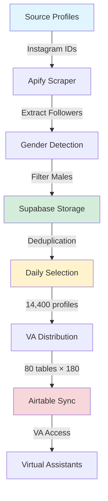

## Overview

Click Creators Scraper is an Instagram marketing automation platform built on a modern, serverless architecture. The system orchestrates Instagram follower scraping, gender-based filtering, campaign management, and multi-tenant VA distribution.

## Tech Stack

### Frontend

<CardGroup cols={2}>
  <Card title="Next.js 14.2.25" icon="react">
    App Router architecture for server-side rendering and optimal performance
  </Card>
  <Card title="TypeScript" icon="code">
    Type-safe development with full IDE support
  </Card>
  <Card title="Tailwind CSS" icon="palette">
    Utility-first CSS framework for rapid UI development
  </Card>
  <Card title="ShadCN UI" icon="layer-group">
    Radix UI primitives with accessible components
  </Card>
</CardGroup>

### Backend

<CardGroup cols={2}>
  <Card title="Flask API" icon="python">
    Python-based REST API for scraping orchestration
  </Card>
  <Card title="Apify" icon="spider">
    Instagram scraping infrastructure
  </Card>
  <Card title="Supabase" icon="database">
    PostgreSQL database with real-time capabilities
  </Card>
  <Card title="Airtable API" icon="table">
    VA workspace synchronization
  </Card>
</CardGroup>

### Database

- **Supabase PostgreSQL** - Primary data store
- **Row Level Security (RLS)** - Built-in access control
- **Real-time subscriptions** - Live data updates

## System Architecture



## Application Flow

### 1. Source Profile Management

**Input:** Instagram usernames or profile URLs  
**Storage:** `source_profiles` table  
**Action:** Admin adds target accounts to scrape followers from

### 2. Follower Scraping

**Service:** Apify Instagram Scraper  
**Process:** 
- Extracts followers from all source accounts
- Collects profile metadata (username, full name, follower count, bio, etc.)
- Handles pagination and rate limiting

### 3. Gender Detection & Filtering

**Method:** Name-based gender detection  
**Filter:** Male profiles only  
**Output:** Filtered dataset ready for ingestion

### 4. Database Ingestion

**Strategy:** Two-table deduplication
- `raw_scraped_profiles` - Stores all scraped data
- `global_usernames` - Deduplicated username pool

### 5. Campaign Creation

**Target:** 14,400 unique unused profiles  
**Process:**
- Creates campaign record in `campaigns` table
- Selects profiles where `used = false`
- Marks selected profiles as `used = true`

### 6. VA Distribution

**Distribution:** 80 VA tables  
**Allocation:** 180 profiles per VA  
**Storage:** `daily_assignments` table with `va_table_number`

### 7. Airtable Synchronization

**Target:** 80 Airtable tables  
**Method:** Batch API uploads with rate limiting  
**Result:** VAs access assigned profiles via Airtable interface

## Key Metrics

<CardGroup cols={2}>
  <Card title="Daily Target" icon="bullseye">
    14,400 unique male profiles per day
  </Card>
  <Card title="VA Count" icon="users">
    80 virtual assistants
  </Card>
  <Card title="Profiles per VA" icon="user-check">
    180 profiles per day
  </Card>
  <Card title="Campaign Lifecycle" icon="calendar">
    7 days before cleanup
  </Card>
</CardGroup>

**Total Weekly Capacity:** 1.008M profiles/week (14,400 × 7 days)

## Data Flow Diagram

```
┌─────────────────────────────────────────────────────────────────┐
│                      INSTAGRAM SCRAPING                         │
│  Source Profiles → Apify → Gender Filter → Raw Profiles DB     │
└─────────────────────────────────────────────────────────────────┘
                              ↓
┌─────────────────────────────────────────────────────────────────┐
│                       DEDUPLICATION                             │
│           Raw Profiles → Global Usernames (unique)              │
└─────────────────────────────────────────────────────────────────┘
                              ↓
┌─────────────────────────────────────────────────────────────────┐
│                    CAMPAIGN CREATION                            │
│     Select 14,400 unused → Mark as used → Create campaign       │
└─────────────────────────────────────────────────────────────────┘
                              ↓
┌─────────────────────────────────────────────────────────────────┐
│                     VA DISTRIBUTION                             │
│        80 tables × 180 profiles → Daily Assignments DB          │
└─────────────────────────────────────────────────────────────────┘
                              ↓
┌─────────────────────────────────────────────────────────────────┐
│                    AIRTABLE SYNC                                │
│         Batch upload to 80 Airtable tables → VA Access          │
└─────────────────────────────────────────────────────────────────┘
```

## Component Architecture

### Frontend Components

<AccordionGroup>
  <Accordion title="Page Components">
    - `/app/callum/page.tsx` - User authentication
    - `/app/callum-dashboard/page.tsx` - Main dashboard
    - `/app/configure/page.tsx` - Job configuration
    - `/app/instagram-jobs/page.tsx` - Instagram jobs
    - `/app/threads-jobs/page.tsx` - Threads jobs
    - `/app/tiktok-jobs/page.tsx` - TikTok jobs
    - `/app/x-jobs/page.tsx` - X (Twitter) jobs
  </Accordion>

  <Accordion title="Feature Components">
    - **DependenciesCard** - Instagram account management & scraping
    - **PaymentsTable** - Scraped results & VA assignment
    - **CampaignsTable** - Campaign history with status
    - **UsernameStatusCard** - Username pool status
    - **AppSidebar** - Navigation and recents
    - **JobListByPlatform** - Jobs display in table format
    - **ConfigureJobCard** - Job creation form
  </Accordion>

  <Accordion title="UI Components (ShadCN)">
    Located in `components/ui/`:
    - `tabs.tsx` - Tab navigation
    - `progress.tsx` - Progress bars
    - `card.tsx` - Card containers
    - `button.tsx` - Buttons
    - `dialog.tsx` - Modal dialogs
    - `input.tsx` - Text inputs
    - `badge.tsx` - Status badges
    - `table.tsx` - Data tables
  </Accordion>
</AccordionGroup>

## Design Principles

### 1. Component Props vs Direct Database Access

**Pattern:** Components receive data via props, not direct Supabase queries  
**Benefit:** Flexibility for future data sources and easier testing

### 2. Auto-Ingest Implementation

**Pattern:** Scraping automatically triggers ingestion  
**Benefit:** Reduced manual steps, seamless user experience

### 3. Sequential Campaign Workflow

**Pattern:** API calls execute sequentially with validation  
**Benefit:** Error isolation and progress tracking

### 4. Two-Table Deduplication

**Pattern:** `raw_scraped_profiles` + `global_usernames`  
**Benefit:** Complete data retention with duplicate prevention

## Performance Considerations

<CardGroup cols={2}>
  <Card title="Pagination" icon="list">
    Tables display configurable items per page for fast rendering
  </Card>
  <Card title="Database Limits" icon="filter">
    Recent items loaded efficiently with SQL LIMIT clauses
  </Card>
  <Card title="Batch Processing" icon="layer-group">
    Scraping and ingestion use configurable batch sizes
  </Card>
  <Card title="Rate Limiting" icon="clock">
    Built-in delays for Airtable API compliance
  </Card>
</CardGroup>

## Security & Access Control

### Authentication

- **Method:** Custom credential-based auth (username, password, OTP)
- **Storage:** Environment variables (`NEXT_PUBLIC_USERNAME`, etc.)
- **Context:** `auth-context.tsx` manages authentication state

### Database Security

- **Row Level Security (RLS):** Enabled on all Supabase tables
- **Service Role:** Backend API uses service role key for full access
- **Anon Key:** Frontend uses anon key with RLS policies

### API Security

- **CORS:** Configured for production domains
- **Rate Limiting:** Applied to external API calls (Apify, Airtable)
- **Environment Variables:** Secrets stored securely, never committed

## Scalability

### Current Capacity

- **Daily:** 14,400 profiles
- **Weekly:** 100,800 profiles (1.008M potential)
- **VAs:** 80 virtual assistants

### Scaling Considerations

1. **Increase VA Count:** Modify distribution logic for more tables
2. **Increase Daily Target:** Configure `NEXT_PUBLIC_DAILY_SELECTION_TARGET`
3. **Add Scraping Sources:** Scale horizontally with more source accounts
4. **Database Performance:** Supabase auto-scales; add indexes as needed

## Monitoring & Maintenance

### Automated Cleanup

**Endpoint:** `POST /api/cleanup`  
**Schedule:** Daily at 2 AM (cron job)  
**Action:** Deletes campaigns older than 7 days and frees profiles

```bash
0 2 * * * curl -X POST http://localhost:5001/api/cleanup
```

### Health Checks

- **Username Pool Status:** Monitor `global_usernames` unused count
- **Campaign Success Rate:** Track `campaigns` table status distribution
- **API Response Times:** Log scraping and sync durations

## Next Steps

<CardGroup cols={2}>
  <Card title="Database Schema" icon="database" href="/architecture/database-schema">
    Explore table structures and relationships
  </Card>
  <Card title="API Integration" icon="plug" href="/architecture/api-integration">
    View API endpoints and request/response formats
  </Card>
</CardGroup>